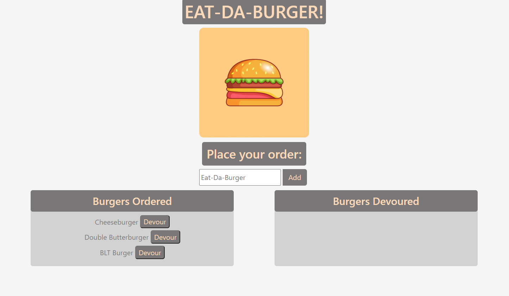

# Eat-Da-Burger <p style="float: right;"><a href="https://opensource.org/licenses/MIT"></a></p>
    
## Description
This repository contains the _**Eat-Da-Burger**_ application, which was created using [Node](https://nodejs.org/en/), [jQuery](https://jquery.com/), [MySql](https://www.mysql.com/), [Handlebars](https://handlebarsjs.com/), [Express](https://expressjs.com/), [Bootstrap](https://getbootstrap.com/), and hosted on [Heroku](https://www.heroku.com). 

#### Functionality
1. The program first reads the database and displays all burgers on the page. A user can add their own burger to the order as well.  
2. Whenever a order is submitted, the burger name gets saved to the database and displayed on the **Ordered** table.  
3. A user then can choose to "*Devour*" the burger, resulting in the burger being placed in the **Devour** table (this updates the unique burger in the database).
4. In the **Devour** table, the user can click the "*Delete*" button and remove the burger from the page (as well as the database).
5. The program remains persistent on reloads no matter what action is taken.




    
## Table of Contents
* [Installation](#installation)
* [Usage](#usage)
* [Contributions](#contributions)
* [Test Instructions](#test-instructions)
* [License](#license)
* [Questions](#questions)

### Installation 
To install this program, it's as simple as cloning the files to your local machine.  Once in the directory, run:
```
npm i
```
This will install the modules/dependencies needed to run the program.

### Usage
To run this program, open the integrated terminal where this program is cloned to.  Run:
```
node server
```
This will start the program and log to the console the localhost address to visit.
### Contributions
The main purpose of this repository is to utilize the MVC structure as well as get acquainted with utilizing handlebars, express, and mysql together. If anyone is willing to contribute to the program, feel free to download it and create a separate branch and improve on it.  Also, feel free to get in touch with me through my email as well.

### Test Instructions
As for this repository, all the testing was done on my end through localhost as well as MySQL Workbench

### License
This project falls under the license: 
[](https://opensource.org/licenses/MIT)
    
### Questions
If you haven't already, and would like to visit my github profile, you can reach me at: https://github.com/DavidESotomayor

Please feel free to reach out to me for any questions, comments, or concerns at : david.elijah.sotomayor@gmail.com

Copyright &copy; David Sotomayor

### Sources
* [Bootstrap](https://getbootstrap.com/)
* [Express.js](https://expressjs.com/)
* [Handlebars.js](https://handlebarsjs.com/)
* [Heroku](https://www.heroku.com)
* [jQuery](https://jquery.com/)
* [MySQL](https://www.mysql.com/)
* [MySQL Workbench](https://www.mysql.com/products/workbench/)
* [Node.js](https://nodejs.org/en/)
* [npm / npm dependencies](https://www.npmjs.com/)
  * [express](https://www.npmjs.com/package/express)
  * [express-handlebars](https://www.npmjs.com/package/express-handlebars)
  * [mysql](https://www.npmjs.com/package/mysql)

